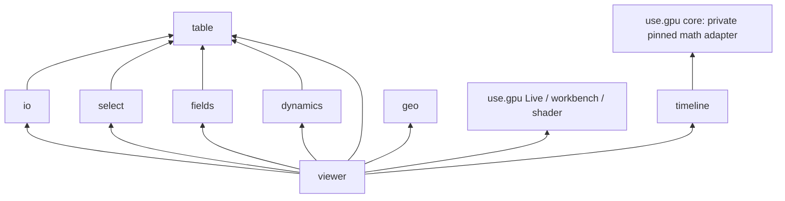

# Current architecture and reading guide

Reviewed 2026-10-02 against `origin/main` at `9b1c5b1`. This is the navigation
and composition map; package READMEs describe supported APIs, dated findings
retain decisions and evidence, and Beads track remaining work.
[DESIGN](DESIGN.md) records intent and [ROADMAP](ROADMAP.md) retains historical
phase outcomes.

## Package boundaries

The eight packages expose ten JSR entries: one per package, plus
`viewer/advanced` and `dynamics/wgsl`. Cross-package code uses these public
entries. There is no production import into another package's private source.

`table` and `geo` have no production runtime dependency. IO is the only
production Mol* consumer, loaded lazily; it currently owns the Mol* molecular
surface adapter as well as decoding. Viewer source loaders and its CPU surface
fallback load IO dynamically. Type imports do not imply a runtime load.

Reducing dependency edges should follow removing a responsibility, not copying
its implementation into callers. Table owns identities, attributes and molecular
data contracts; select owns query semantics; fields owns field evaluation and
WGSL generation; dynamics owns scientific kernels; geo owns geometry. Live and
GPU adaptation stay in viewer. Exact use.gpu `0.20.0` and bundled browser viewer
execution are the verified dependency contract.

## Dataset scopes and specialized consumers

| Scope            | Provides                                                                                    | Shadows or inherits                                                                                              | Specialized consumers                                                                      |
| ---------------- | ------------------------------------------------------------------------------------------- | ---------------------------------------------------------------------------------------------------------------- | ------------------------------------------------------------------------------------------ |
| Structure        | Topology/resource, root coordinates, shared radii, immutable column owner                   | Resets coordinates, attribute and snapshot scopes, and trajectory metadata; inherits independent volume and time | Atom/polymer/surface visuals, picking, annotations, coordinate transforms, DSSP and EField |
| Trajectory       | Coordinates over the nearest Structure's fixed row layout, displayed frame and periodic box | Replaces coordinates; metadata belongs to that Structure; pending source passes upstream coordinates through     | UnitCell, default Unwrap box, Superpose `to="first"`, `useTrajectoryFrame`                 |
| Volume           | Grid, GPU samples, loaded CPU samples or demand-driven snapshots                            | Replaces nearest volume; preserves Structure, coordinates, trajectory and time                                   | Isosurface, VolumeSlice, FieldLines, FieldArrows, nearest-volume fields                    |
| EField           | Computed Volume from nearest coordinates and charges                                        | Replaces volume for descendants                                                                                  | The same volume consumers as loaded Volume                                                 |
| TimelineProvider | Seconds-based application time                                                              | Independent of molecular dataset boundaries                                                                      | Curve-driven playback, transform parameters, styling and camera                            |

Trajectory is a coordinate provider within Structure, not a separate topology.
Transform, NormalMode, ElasticNetwork and ordinary Superpose accept the nearest
coordinate scope without requiring a trajectory. Unwrap can use an explicit box.
UnitCell shows nothing without displayed periodic metadata. Volume visuals do
not require a Structure. A structure nested under a volume may use that volume
in its fields; a nested Structure cannot use its outer Structure's trajectory.

Keep these distinctions in public JSX rather than adding a generic dataset node,
scene graph, or a package for each specialized visual. IO's `openTrajectory`
plus `<Trajectory data>` already lets an application own source opening.
Separate internal request, cache/window, playback and metadata modules when it
removes coupling; no extra public source component is required.

A pending or failed `Trajectory src` retains its structure-owned scope.
`Superpose to="first"` passes upstream coordinates through while the source or
first-frame reference is unavailable and reports its state through `onStatus`.
An absent Trajectory ancestor remains an error. See the
[source recovery evidence](findings/2026-10-02-superpose-source-recovery.md) and
[implementation completion](findings/2026-10-02-ktr-implementation-completion.md).

## Live and snapshot policies

- Spacefill, Bonds and BallAndStick draw nearest GPU coordinates. Assembly
  operators apply after the coordinate providers without duplicating topology.
- Ribbon/Cartoon, Tube and annotation anchors use published CPU coordinates;
  snapshots are demand-driven, normally at 4 Hz and on pause.
- Surface uses a live GPU rebuild for supported moving-coordinate grids, with
  one job in flight and latest-request coalescing. Root/static geometry and
  unsupported GPU cases use the CPU snapshot fallback.
- VolumeSlice, FieldLines and FieldArrows consume GPU volume samples. Isosurface
  extracts a CPU mesh from loaded data or a published volume snapshot.
- Query membership can trail live positions and colors. Combined coordinate and
  attribute publications are latest-published, not necessarily from one frame.
  Owner/source/layout replacement withdraws incompatible membership.

Readiness means the requested producer was submitted, and snapshot identity
includes its owner/source/layout and local generation. Retained
draw/dispatch/copy references govern lifetime. Style edits do not regenerate
geometry or upload coordinates; first demand for an immutable column may upload
it once.

## Current decisions and evidence

- [Ordinary JSX and styling](findings/2026-10-01-ordinary-jsx-selection-styling-decision.md)
  and [selection adapters](findings/2026-10-01-scoped-selection-adapters.md).
- [Ownership](findings/2026-10-01-data-ownership-decision.md),
  [source presentation](findings/2026-10-01-source-presentation-decision.md),
  and [source/playback](findings/2026-10-01-source-playback-decision.md).
- [GPU publication](findings/2026-09-28-gpu-publication-contract.md),
  [retirement decision](findings/2026-09-29-gpu-retirement-decision.md), and
  [retirement acceptance](findings/2026-10-01-gpu-retirement-acceptance.md).
- [Native primitive audit](findings/2026-10-02-native-compute-audit.md),
  [GPU surface](findings/2026-10-02-gpu-ses-field.md),
  [assembly decision](findings/2026-10-01-assembly-instances-decision.md)
  (historical deferral; later drawing support is described in viewer README),
  and [public-composition gate](findings/2026-10-02-crj13-architecture-gate.md).
- [Second-pass plan](findings/2026-10-02-second-pass-plan.md) and
  [second-pass conclusions](findings/2026-10-02-second-pass-review.md), tracked
  with
  [implementation completion](findings/2026-10-02-ktr-implementation-completion.md).

The September 28 review motivated the completed architecture repairs. Its
findings remain historical evidence; read the current gate and implementation
completion before treating an old failure as open. Browser coverage work and the
ordered native-kernel experiment remain separately tracked in the issue tracker.
