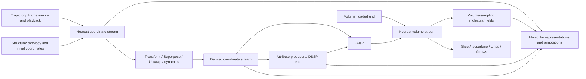

# Viewer source organization proposal

Date: 2026-10-10. Baseline: `d54ace6`, the final follow-up revision in draft PR
#91. Scope: source navigation and internal organization, not implementation. The
public entries remain `@molgpu/viewer` and `@molgpu/viewer/advanced`. Tracking
decision: `molgpu-sept-9fw`.

## Recommendation

Use a hybrid of dataset folders and shared capabilities. Give `Structure`,
`Trajectory` and `Volume` recognizable homes, then name the streams their
descendants consume: coordinates, attributes and volumes. Keep molecular
representations together and rendering mechanics separately. Organize each
feature's private implementation beside its owner instead of placing everything
private in one `internal/` directory.

This is a proposal for an internal file layout. It preserves the current scope
contracts, component names and JSX nesting. It introduces no package, public
subpath, dataset superclass, scene graph or generic resource framework.

The October 4 review recommended against a mass folder move without demonstrated
benefit. The new motivation is explicit: navigation through a growing package.
The source now has **114 files: 48 top-level and 66 under `internal/`**. This
proposal addresses findability; it does not claim faster rendering, smaller
bundles or fewer dependency edges.

## The relationships the layout should teach

These components accept renderer-free molecular values and adapt them into Live
scopes and GPU resources. They are not simply three equivalent loaded-data
containers: `src` convenience paths still open data lazily, and Trajectory needs
a Structure-owned row layout.

| Component                                                | Owns or publishes                                                                      | Downstream relationship                                                                                                                  |
| -------------------------------------------------------- | -------------------------------------------------------------------------------------- | ---------------------------------------------------------------------------------------------------------------------------------------- |
| Structure                                                | Topology/resource, initial coordinates, radii and immutable-column ownership           | Establishes the molecular identity and row layout. Descendants may replace coordinates or overlay attributes without replacing topology. |
| Trajectory                                               | Playback cache/window, interpolated coordinates, displayed frame and periodic metadata | A coordinate provider inside Structure. It preserves topology and supplies metadata used by UnitCell, Unwrap and first-frame Superpose.  |
| Volume                                                   | Independent grid, shared GPU samples and loaded CPU samples                            | Does not require Structure. VolumeSlice, Isosurface, FieldLines and FieldArrows consume the nearest volume.                              |
| EField                                                   | A computed volume from coordinates and charge attributes                               | Bridges a molecular scope into the same volume contract as a loaded Volume.                                                              |
| Transform, Superpose, Unwrap, NormalMode, ElasticNetwork | A replacement coordinate stream                                                        | Consume nearest coordinates; most do not require Trajectory. Preserve count/order and isolate output from siblings.                      |
| GpuDssp / AttributeProducer                              | Produced attribute streams and requested CPU snapshots                                 | Overlay molecular attributes without changing topology.                                                                                  |



The graph shows dataflow, not legal sibling JSX: a consumer must be below the
provider whose scope it reads. A full trajectory replaces upstream positions;
put transformations below it to affect displayed frames. Mapped trajectories
preserve unmapped upstream rows.

A nested Structure resets coordinates, attributes, snapshots and trajectory
metadata. It inherits an independent Volume and timeline. A Volume replaces only
the volume scope. Folder membership must never imply different inheritance.

## Alternatives

| Layout                                                                                                          | Advantages                                                                                                                                        | Costs / decision                                                                                                                                                                                                                                                             |
| --------------------------------------------------------------------------------------------------------------- | ------------------------------------------------------------------------------------------------------------------------------------------------- | ---------------------------------------------------------------------------------------------------------------------------------------------------------------------------------------------------------------------------------------------------------------------------- |
| Dataset trees: `structure/{transforms,representations}`, `trajectory/...`, `volume/{producers,representations}` | Closest to the three entry concepts; easy to locate a dataset and its familiar descendants.                                                       | Structures contain nearly everything molecular. Unwrap and Superpose cross trajectory/coordinate boundaries, and fields bridge structure and volume. Viable if browse-by-dataset is the overriding preference, but folder containment can be mistaken for runtime ownership. |
| Role trees: `scopes/`, `providers/`, `representations/`, `adapters/`                                            | Makes producer/consumer roles explicit and groups similar mechanisms.                                                                             | Structure, Trajectory and Volume are scattered from the private mechanics they own; `providers` becomes ambiguous because datasets and transforms both provide contexts.                                                                                                     |
| Hybrid: dataset homes plus coordinates, attributes and shared adapters                                          | Keeps the three entry concepts recognizable while making the common streams explicit. Feature ownership and cross-scope bridges have clear homes. | More sibling directories; their roles need a short source reading guide. **Recommended.**                                                                                                                                                                                    |

## Proposed layout

```text
src/
  index.ts                     ordinary public exports
  advanced.ts                  extension public exports
  types.ts                     caller contracts; retain initially
  timeline-context.ts          small independent time scope

  structure/                   6 files
    structure.ts
    structure-context.ts
    structure-resource.ts
    instance-context.ts
    instance-plan.ts
    instance-copies.ts

  trajectory/                  6 files
    trajectory.ts
    trajectory-context.ts
    use-trajectory-frame.ts
    trajectory-player.ts
    frame-cache.ts
    frame-window.ts

  volume/                      13 files
    volume.ts
    volume-context.ts
    volume-buffers.ts
    efield.ts / efield-grid.ts
    isosurface.ts / isosurface-geometry.ts
    volume-slice.ts
    field-lines.ts / field-line-geometry.ts
    field-arrows.ts
    slice-plane.ts / color-ramp.ts

  coordinates/                 13 files
    coordinates-context.ts
    coordinate-snapshot.ts
    coordinate-kernel.ts / coordinate-passes.ts
    use-coordinate-selection.ts / use-coordinate-bounds.ts
    transform.ts / superpose.ts / unwrap.ts
    normal-mode.ts / elastic-network.ts / elastic-bindings.ts
    copy-positions-wgsl.ts

  attributes/                  10 files
    attributes-context.ts
    attribute-producer.ts
    attribute-snapshot.ts / attribute-snapshot-context.ts
    attribute-values.ts / immutable-attribute-cache.ts
    gpu-dssp-provider.ts / gpu-dssp.ts / gpu-scan.ts
    ribbon-dssp.ts

  representations/             24 files
    spacefill.ts / bonds.ts / ball-and-stick.ts
    tube.ts / ribbon.ts / surface.ts
    annotations.ts / unit-cell.ts / ramachandran.ts
    world-space-points.ts
    ... feature geometry, attribution and scientific-view helpers

  selection/                   5 files: query resolution and presentation
  fields/                      5 files: viewer-side field planning/binding
  rendering/                   10 files: columns, materials, sizing, opacity
  interaction/                 6 files: picking, pointer projection, camera/focus
  internal/                    12 files: genuinely shared runtime mechanics
```

The [complete file map](evidence/2026-10-10-viewer-organization-inventory.json)
assigns every source file exactly once, records current relative imports and
lists candidate path-sensitive consumers. Keep filenames in the first pass so
reviewers can follow moves. Folder-local files remain private unless one of the
two public entries exports them. Do not add a barrel for every directory; direct
relative imports keep dependencies inspectable.

The largest proposed folder, representations, has 24 files. If a second level
helps browsing, surface is the strongest candidate: seven files (`surface`,
`surface-geometry`, `surface-gpu`, `use-gpu-surface`, `ses-field`,
`marching-cubes-gpu`, `attribution-gpu`). Avoid one folder per component by
default. Volume's producers and consumers can remain together at 13 files.

Placement follows the contract being published or consumed. EField belongs in
volume because its output is a volume, with its molecular inputs documented.
Transforms belong in coordinates rather than trajectory because they also work
over static structures. UnitCell remains a molecular representation with an
explicit trajectory-metadata dependency. The attribute folder holds viewer
adapters, not the renderer-free attribute schema or scientific DSSP reference.

Shared `internal/` retains request/status delivery, readback tokens/staging,
dispatch observation, compute-input allocation, geometry-job scheduling,
instrumentation and repaint/binding probes. Each resource's feature owner and
retirement path remain where they are today.

## Logic boundaries worth making explicit

A move alone will not turn these directories into strict dependency layers.
Contexts and adapters have legitimate cross-folder imports. Context definitions
should remain lightweight where they already are; provider orchestration may
import those contracts, and downstream consumers should read the nearest scope.

`internal/representation.ts` currently mixes atom-selection validation,
active-row resolution, Field identification and column binding. Moving it to
rendering preserves that mixed role initially. A later bounded extraction could
put validation/active rows in selection and Field identification in fields,
while keeping column binding in rendering. Do this separately from path moves,
with tests proving the existing behavior. This is the clearest candidate for a
small logic cleanup, not a prerequisite for the folder proposal.

`types.ts` is 559 lines, but splitting it simultaneously would complicate API
review. Retain it initially. Later, feature-owned prop types may live with their
component and still be re-exported through the same entries. No caller should
need private imports or new namespace imports such as `Structure.Spacefill`.

The recent trajectory-player extraction and owner-checked frame-reader split
already landed under `9es.5` and `9es.6`; do not repeat those refactors or
reopen the completed architecture epic. The source/playback decision already
keeps one public Trajectory with either `src` or preloaded `data`.

## Acceptance example and migration sequence

The
[executable composition example](evidence/2026-10-10-viewer-organization-example.tsx)
uses only existing public exports. It demonstrates transformed trajectory
coordinates, a standalone loaded volume and a computed volume under Structure.
It runs beneath the application's existing canvas/device/camera/pass; it
introduces no renderer. It is a type-checked example, not fresh rendered proof.

Keep this JSX unchanged through migration. Also preserve the browser cases for
nested structures resetting trajectory metadata, volume/time inheritance,
sibling isolation, source replacement and readback retirement. Static typing
cannot certify those runtime relationships.

1. After the layout decision and PR #91 merge, move trajectory's six files as a
   small pilot. Update imports, entries and private-path consumers. Preserve all
   functions, shaders, contexts, ownership and status behavior.
2. Move structure, volume and their owned helpers. Update affected browser
   fixtures, dynamic imports and instrumentation URLs. Preserve lazy IO paths.
3. Group coordinates and attributes, keeping publication and teardown code
   unchanged. Then group representations and their feature geometry.
4. Move shared selection, field, rendering and interaction adapters. Leave only
   truly shared runtime mechanics in `internal/`; add a concise source reading
   guide linked from the package README.
5. Consider mixed-helper extraction separately, only after the mechanical layout
   passes its checks. It should have its own diff and acceptance evidence.

For each batch: scoped formatting/lint, type checking, relevant unit/browser
suites and `check:hardening`; review any API snapshot changes rather than
blindly accepting them. At the migration gate run component/site type checks,
JSR dry run and the affected hosted WebGPU groups. The inventory finds **69
candidate path-sensitive consumers** using a text scan; this is a search aid,
not an exhaustive import resolver. There are direct private imports, dynamic
imports and Vite `/@fs` URLs. `src` remains inside the publish allowlist, and
the two manifest export paths stay unchanged.

## Evidence limits

Read root and viewer guides, actual Deno exports, the September architecture
review, current architecture map, October viewer review, source/playback
decision and completed cleanup issues. Inspected dataset components/contexts,
coordinate publication, EField's volume publication, field lowering and
representation helpers. Inventoried every TypeScript source file without moving
production code.

This review measures file counts and maps responsibilities. It does not measure
bundle size, performance, or validate a hypothetical migrated tree. Existing
green PR #91 validation belongs to its current layout; each future move still
needs proportional checks. This proposal is ready for discussion, not automatic
implementation authorization.

Fresh review checks: the inventory has 114 unique current and proposed paths and
exactly covers the current source tree; the public composition example passes
`deno check` and scoped lint. The three review artifacts pass formatting.
